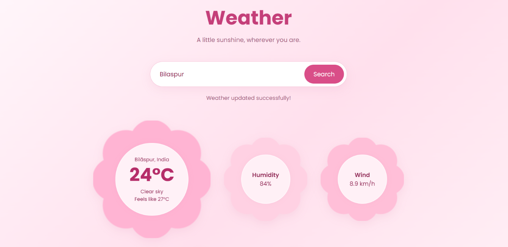

# Bloomy Weather

** Weather Dashboard**
Internship Task 3
Weather Dashboard is a responsive weather web application built with HTML, CSS, and JavaScript. It features a soft pink floral design with flower-shaped cards that display real-time weather information.

## Features

- Search weather by city name
- Current temperature and weather conditions
- Feels-like temperature
- Humidity and wind speed
- Daily minimum and maximum temperature
- Flower-shaped weather information cards
- Responsive pink-themed interface
- Error handling for invalid cities and API failures

## Technologies Used

- HTML5
- CSS3
- JavaScript
- Fetch API
- Open-Meteo Geocoding API
- Open-Meteo Weather Forecast API

## Project Structure

```text
bloomy-weather/
├── index.html
├── style.css
├── script.js
├── README.md
└── .gitignore
```


## How to Run

1. Clone or download this repository.
2. Open the project folder in VS Code.
3. Run `index.html` using the Live Server extension.
4. Enter a city name to view its weather information.

## API Information

This project uses Open-Meteo to retrieve geographical coordinates and weather data. No API key is required for the standard non-commercial use described by Open-Meteo.

Weather data attribution: [Open-Meteo](https://open-meteo.com/)

## Purpose

Created as an internship project to practice DOM manipulation, event handling, asynchronous JavaScript, Fetch API, JSON parsing, and responsive web design.

---

**Made with spirit to learn by Akriti Singh**